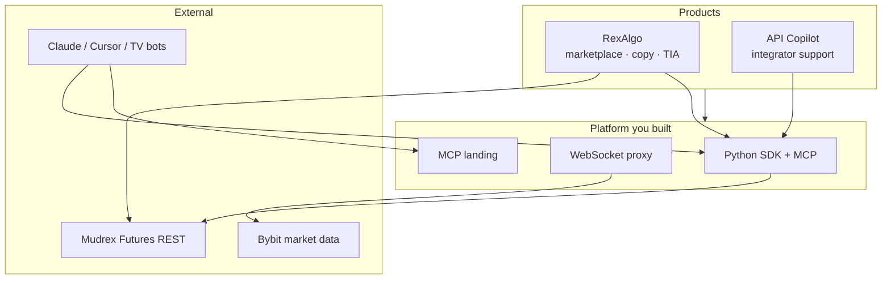

# Jithin Mohandas (JM)

**Product Manager at [Mudrex](https://mudrex.com)** · I ship **developer platforms** (REST API, WebSocket, MCP) and **trading products** (algo marketplace, copy trading, advisory) on top of them.

Bengaluru · Builder-PM — specs, trade-offs, and working systems, not slide decks about agents.

---

## Currently (Q2 2026)

Shipping **Mudrex Futures** as a platform other teams can build on: SDKs, real-time streams, MCP for AI clients, and **RexAlgo** for masters and subscribers. Tightening ledger correctness, webhook security, and production observability on RexAlgo; extending MCP and API copilot for integrators.

---

## Selected work

| | Project | Why it matters |
|---|---------|----------------|
| **1** | [**RexAlgo**](https://github.com/DecentralizedJM/RexAlgo) | End-to-end **consumer product**: algo marketplace + copy trading + trade-idea (TIA) flows on Mudrex Futures — auth, encrypted keys, HMAC webhooks, subscriber mirroring, CI + load tests. This is the “I own a product” proof. |
| **2** | [**mudrex-api-trading-python-sdk**](https://github.com/DecentralizedJM/mudrex-api-trading-python-sdk) | **Platform wedge** for integrators: rate limits, error taxonomy, modular REST surface, **MCP server** so Claude/Cursor can trade with guardrails. |
| **3** | [**mudrex-proxy-server-websocket**](https://github.com/DecentralizedJM/mudrex-proxy-server-websocket) | **Realtime infra**: one Bybit upstream → Mudrex-branded streams → Redis fan-out — subscription ref-counting, per-client limits, graceful shutdown. |
| **4** | [**mudrex-mcp-prod-landing-page**](https://github.com/DecentralizedJM/mudrex-mcp-prod-landing-page) | **GTM** for MCP: API keys, tool catalog, Claude config — turns protocol work into something teams can adopt in minutes. |
| **5** | [**Mudrex-API-Copilot**](https://github.com/DecentralizedJM/Mudrex-API-Copilot) | **Developer support product**: RAG over API docs + live MCP tools in Telegram — scope guards, semantic cache, listing watcher. |

**Also:** [`mudrex-api-trading-SDK-registry`](https://github.com/DecentralizedJM/mudrex-api-trading-SDK-registry) (multi-language index) · [`mudrex-trade-ideas-html-cards`](https://github.com/DecentralizedJM/mudrex-trade-ideas-html-cards) (advisory embeds) · [`mudrex-futures-API-papertrading-py-sdk`](https://github.com/DecentralizedJM/mudrex-futures-API-papertrading-py-sdk) (paper + OpenAPI for AI demos).

<strong>Platform map</strong> (one diagram)

---

## How I think about product

**Thin wedge over platform theater.** I would rather ship a Python SDK one integrator uses daily than announce five languages and a “multi-agent roadmap” with no adoption. Mudrex MCP followed that rule: tools that map to real REST endpoints, then a landing page that shows the exact Claude config.

**Reliability is a product feature.** On the WebSocket proxy, the product decision was one upstream connection and Redis ref-counting so we do not open a Bybit socket per client. On RexAlgo, Mudrex rate limits are modeled as parallel second/minute/hour windows per route family — because the API enforces them that way, not as “2 req/s × 60.”

**Trust beats cleverness in trading.** Copy trading gets HMAC-signed webhooks, short replay windows, and idempotency keys — not because security sells, but because one bad mirror fill destroys master credibility. I document open ledger and rollup decisions in audit write-ups instead of hiding ambiguity in dashboards.

**AI is a interface, not a personality.** The API copilot uses Gemini with off-topic guards and semantic cache for cost — it should answer like a senior support engineer, not a general chatbot. MCP is how external agents get the same bounded tool surface, not a substitute for API design.

---

## Background

Business Development → Customer Success → Product Marketing → **Product Management** → platform & trading products at a regulated crypto fintech.

---

## Writing & contact

- **Essays:** [decentralizedjm.medium.com](https://decentralizedjm.medium.com)
- **X:** [@Decentralizedjm](https://twitter.com/Decentralizedjm)
- **Email:** mohandasjithin@gmail.com

---

## For reviewers

Deeper inventory, skill citations, PM artifact scaffolds, and README drafts for individual repos live in [`portfolio-rewrite/`](portfolio-rewrite/) on this branch — written for PM roles at API-first and AI-native companies. Metrics in those files use `TODO[JM]` where only I can supply real numbers.

If you are hiring for **platform PM**, **developer tools**, or **fintech + AI**, start with **RexAlgo** and the **Python SDK + MCP** pair, then ask me about one decision I regret — I have several documented.
