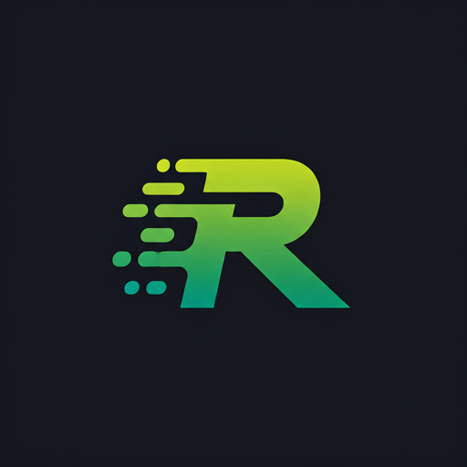

# Hey there! I'm JM 👋

### Product Manager @ Mudrex · Builder-PM · API · Algo · MCP

  
   
  

---

## 🎯 About Me

- 🏦 **PM at Mudrex** — Futures API, real-time streams, MCP, and trading products
- Building **[RexAlgo](https://github.com/DecentralizedJM/RexAlgo)** — algo marketplace, copy trading & advisory on Mudrex Futures
- 🔌 Shipped **Python SDK + MCP**, **WebSocket proxy**, and an **API copilot** for integrators & devs
- 📈 Path: BD → CS → PMM → **Product** → crypto fintech & AI tooling
- ✍️ Sometimes I write on [Medium](https://decentralizedjm.medium.com)

---

## 🛠️ Tech Stack

  
  
  
  
  
  
  
  
   
  
  
  
  
  
  
  
  

---

## ⭐ Current Projects

<table>
<tr>
<td width="50%" valign="top">

### RexAlgo

**Algo marketplace + copy trading**

 

Masters publish strategies → subscribers mirror **signed webhooks** into their own Mudrex accounts. Trade ideas (TIA), TradingView alerts, encrypted API keys, CI + load tests.

`React` `Next.js` `PostgreSQL` `Redis` `Docker` `MCP`

</td>
<td width="50%" valign="top">

### ⚡ Mudrex API Trading

**API · WebSocket · MCP · Copilot**

SDK + MCP for Claude/Cursor · WS proxy (Bybit → Mudrex streams) · MCP landing · Telegram API copilot with RAG.

`Python` `FastMCP` `asyncio` `Railway` `Cloudflare`

</td>
</tr>
<tr>
<td valign="top">

### 🤖 MCP & AI DevTools

**Agents that can actually trade (safely)**

MCP server on the Python SDK · prod landing with API keys · paper-trading OpenAPI for demos.

`MCP` `OpenAPI` `Gemini` `RAG`

</td>
<td valign="top">

### 📊 Currently Focused On

**What I'm leveling up this quarter**

- 🧩 **Ledger & volume truth** on RexAlgo (audit → ship)
- 📡 **WebSocket scale** — fan-out, rate limits, idle cleanup
- 🤝 **Integrator UX** — fewer support pings via copilot + docs
- 🎯 **Advisory surfaces** — trade-idea cards & TIA flows

`Product` `Fintech` `System Design`

</td>
</tr>
</table>

---

## 📊 GitHub Stats

  
  
   
  

---

**Bengaluru, India** · [X @Decentralizedjm](https://twitter.com/Decentralizedjm) · [Medium](https://decentralizedjm.medium.com) · mohandasjithin@gmail.com

 

