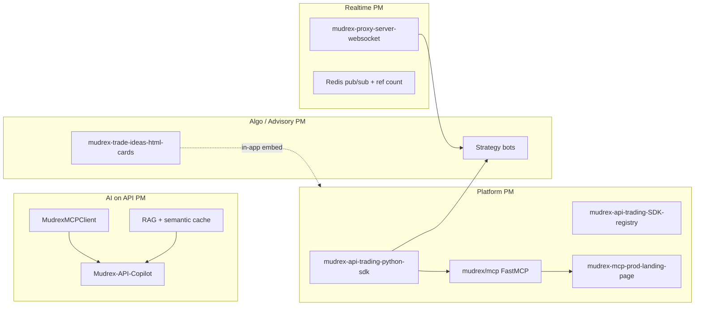

# Phase 2 — Skill & knowledge map (PM focus)

**Generated:** 2026-05-27  
**Gap-close strategy:** **B** — add small real commits/repos (see `gap-fill/README.md`).  
**Scope:** Your stated PM domains — **REST API**, **WebSocket**, **MCP**, **algo trading**, **advisory trading**, **RexAlgo** — not hero-repo selection (you’ll attach those separately).  
**Source of truth:** Shallow clones under `portfolio-rewrite/.repo-scan/`, cross-checked against profile README at `DecentralizedJM/README.md`.  
**Citation format:** `repo/path.py:Lstart-Lend` (line numbers from scanned clone).

---

## How to read this

| Table | Meaning |
|-------|---------|
| **A — Demonstrated** | Skill backed by **your** code (not upstream forks). |
| **B — Claimed but absent / weak** | Profile README or bio claim **not substantiated** in your original API/MCP/trading work (or only in forks/vendor mirrors). |

**Repos in focus (original work):**

| Domain | Primary repos |
|--------|----------------|
| REST / platform | `mudrex-api-trading-python-sdk`, `mudrex-api-trading-{go,java,nodejs,dotnet}-sdk`, `mudrex-api-trading-SDK-registry` |
| WebSocket | `mudrex-proxy-server-websocket`, `free-weight-strategy-mudrex-api`, `BTC-momentum-catcher-strategy` |
| MCP | `mudrex-api-trading-python-sdk`, `mudrex-futures-API-papertrading-py-sdk`, `Mudrex-API-Copilot`, `mudrex-mcp-prod-landing-page` |
| Algo trading | `XAUT-EMA-Pullback-Strategy`, `funding-fee-farming-strategy`, `free-weight-strategy-mudrex-api`, `BTC-momentum-catcher-strategy` |
| Advisory / trade ideas | `mudrex-trade-ideas-html-cards` |
| API copilot (dev UX) | `Mudrex-API-Copilot` |
| **RexAlgo (product)** | **Not scanned** — see `03-rexalgo.md`; attach repo/docs. Adjacent: `mudrex-trade-ideas-html-cards`, strategy bots on Mudrex API |

---

## Table A — Demonstrated skills

| Skill | Evidence (repo + file + lines) | PM relevance |
|-------|----------------------------------|--------------|
| **REST client design (modular API surface)** | `mudrex-api-trading-python-sdk/mudrex/client.py:L56-L140` — `MudrexClient` wires wallet/assets/leverage/orders/positions/fees modules | Platform PM: stable resource-oriented surface for integrators |
| **Client-side rate limiting** | `mudrex-api-trading-python-sdk/mudrex/client.py:L30-L53` (`RateLimiter`); `mudrex-api-trading-go-sdk/client.go:L30-L57` | Protects integrators from 429s; documents product limits in code |
| **429 / Retry-After retry loop** | `mudrex-api-trading-python-sdk/mudrex/client.py:L172-L205` | Production REST hygiene you can narrate as a product decision |
| **Structured API error taxonomy** | `mudrex-api-trading-python-sdk/mudrex/exceptions.py:L97-L128`, `L337-L338`, `L444` — `MudrexRateLimitError`, `ERROR_CODE_MAP`, `raise_for_error` | Developer experience / support deflection |
| **Pagination (fetch-all pages)** | `mudrex-api-trading-python-sdk/mudrex/api/fees.py:L37-L96` | Common futures API pain; shows you’ve shipped against real list endpoints |
| **Order lifecycle REST (market/limit)** | `mudrex-api-trading-python-sdk/mudrex/api/orders.py:L25`, `L201-L232` | Core trading API PM vocabulary |
| **Typed domain models (precision as strings)** | `mudrex-api-trading-python-sdk/mudrex/models.py:L1-L50` — dataclasses/enums; docstring L5-L6 | API contract discipline (no float rounding bugs) |
| **MCP server exposing REST tools (FastMCP)** | `mudrex-api-trading-python-sdk/mudrex/mcp/server.py:L1-L60`; tools `mudrex/mcp/tools.py:L9-L79` (`TypedDict` tool schemas) | **MCP PM:** maps product capabilities → agent-callable tools |
| **MCP client (remote SSE/JSON-RPC)** | `Mudrex-API-Copilot/src/mcp/client.py:L21-L80` — `MudrexMCPClient`, `tools/list`, `aiohttp` | Consumes your own MCP product from a copilot |
| **Paper trading + SQLite persistence** | `mudrex-futures-API-papertrading-py-sdk/mudrex/paper/engine.py:L40-L50`; `paper/persistence.py:L5-L84` | Safe integrator sandbox without live capital |
| **OpenAPI / ChatGPT Actions surface** | `mudrex-futures-API-papertrading-py-sdk/mudrex/api_server.py:L206-L292` — FastAPI, custom `openapi`, `/openapi.json` | Distribution PM: third-party clients beyond SDK |
| **Second MCP stack (stdio Server)** | `mudrex-futures-API-papertrading-py-sdk/mudrex/mcp_server.py:L1-L40` | Alternate MCP transport for paper mode |
| **WebSocket upstream + transform** | `mudrex-proxy-server-websocket/app/upstream/pool.py:L17-L87`; `app/upstream/bybit_client.py:L25-L28` (reconnect docstring) | Market-data platform story |
| **`asyncio` production WS server** | `mudrex-proxy-server-websocket/app/standalone_server.py:L15-L37`, `L255-L284` — `serve()`, signal handlers | Real async concurrency (not import-only) |
| **Exponential backoff reconnect** | `mudrex-proxy-server-websocket/app/upstream/bybit_client.py:L170-L179` | Reliability narrative for streaming products |
| **Graceful shutdown (drain clients)** | `mudrex-proxy-server-websocket/app/standalone_server.py:L202-L234`, `L262-L269` | Ops-ready lifecycle |
| **Per-client WS rate limiting** | `mudrex-proxy-server-websocket/app/websocket/manager.py:L31-L38` | Abuse protection at scale |
| **Redis connection pool + retry** | `mudrex-proxy-server-websocket/app/redis/client.py:L1-L50` | Multi-instance fan-out foundation |
| **Subscription ref-counting (multi-tenant)** | `mudrex-proxy-server-websocket/app/redis/subscriptions.py:L16-L59` — `hincrby`, upstream subscribe only when needed | Cost control: one Bybit sub per symbol cluster |
| **Pub/sub fan-out + listener retry** | `mudrex-proxy-server-websocket/app/redis/pubsub.py:L22-L54` | Horizontal scale pattern |
| **Health / ready / stats HTTP on WS port** | `mudrex-proxy-server-websocket/app/standalone_server.py:L67-L74`, `L70-L71` | SRE-friendly API product |
| **Stream payload normalization (tests)** | `mudrex-proxy-server-websocket/tests/test_transformer.py:L1-L24` | Contract tests for Bybit→Mudrex mapping |
| **RAG pipeline for API docs** | `Mudrex-API-Copilot/src/rag/pipeline.py:L39-L60` — vector store, query planner, semantic cache | Support automation / devrel copilot |
| **Off-topic guard (product scope)** | `Mudrex-API-Copilot/src/rag/pipeline.py:L62-L75` | Prevents generic LLM drift |
| **Semantic cache (cost control)** | `Mudrex-API-Copilot/src/rag/semantic_cache.py:L30-L49` — embedding similarity threshold | PM lever: unit economics of AI support |
| **Scheduled jobs (listings watcher)** | `Mudrex-API-Copilot/src/tasks/scheduler.py:L38-L42`; `futures_listing_watcher.py:L174-L192` — MCP `list_futures` pagination | Keeps copilot in sync with API catalog changes |
| **Health checks (Redis, vector, MCP, Telegram)** | `Mudrex-API-Copilot/src/health.py:L154` — `asyncio.gather` on dependencies | Operable AI product |
| **Gemini configuration (primary LLM)** | `Mudrex-API-Copilot/src/config/settings.py:L36-L37`, `L61-L63` | Honest stack for copilot (not multi-vendor) |
| **MCP product landing (GTM)** | `mudrex-mcp-prod-landing-page` — Cloudflare/TanStack app (`src/routes/index.tsx` per inventory); README documents live MCP URL | PM-facing launch surface |
| **Algo: WS market data consumer** | `free-weight-strategy-mudrex-api/src/bybit_ws/client.py:L71-L76`, `L276-L308` — auto-reconnect loop | Shows you understand client-side stream consumers |
| **Algo: WS + REST throttle** | `BTC-momentum-catcher-strategy/bot.py:L116`, `L146`, `L340-L346` — pybit `WebSocket`, REST throttle on sync path | Advisory/algo split: ticks vs execution |
| **Algo: external data rate limits** | `XAUT-EMA-Pullback-Strategy/data/bybit_klines.py:L4`, `L49-L58` | Bybit 10006 handling |
| **Algo: execution retries** | `XAUT-EMA-Pullback-Strategy/exchange/mudrex_client.py:L15`, `L99` | Live trading REST resilience |
| **Algo: ML gate on signals** | `XAUT-EMA-Pullback-Strategy/strategy/institutional_ml.py:L1-L31` — `TradeSignal`, probability | Advisory/quant rigor (frame carefully for PM) |
| **Advisory: trade-idea UI contract** | `mudrex-trade-ideas-html-cards/trade-idea-widget-light.html:L1-L40` — embeddable widget, `TradeIdeaWidget.render()` pattern (see README) | In-app advisory UX without backend in repo |
| **Async SDK usage pattern (wrapper)** | `mudrex-api-trading-python-sdk/examples/async_trading.py:L5-L9`, `L12-L27`, `L85` — `asyncio.gather` over thread pool; **note:** base client is sync | Qualify in portfolio: “async via executor,” not native async SDK |
| **Docker packaging** | `mudrex-proxy-server-websocket/Dockerfile`; `Mudrex-API-Copilot/Dockerfile:L1` | Deployability for two flagship services |
| **Unit tests (partial)** | `mudrex-api-trading-python-sdk/tests/test_exceptions.py:L1-L30`; `tests/test_models.py`; `mudrex-proxy-server-websocket/tests/test_transformer.py:L4-L24` | Some CI-quality signal; not uniform across repos |
| **SDK registry / docs hub** | `mudrex-api-trading-SDK-registry/README.md` — matrix of languages (docs-only repo) | PM artifact for multi-SDK GTM |

---

## Table B — Claimed but absent or weak

Cross-reference: **profile README** (`DecentralizedJM/README.md`) and your stated positioning. “Absent” = no meaningful implementation in **your original** API/WS/MCP/trading repos (forks like `ccxt`, `llm-council`, `awesome-llm-apps` do **not** count).

| Profile / bio claim | Verdict | Evidence of gap |
|---------------------|---------|-----------------|
| **Multi-agent systems** (`README.md:L45`) | **Absent** in your work | No `CrewAI`, `LangGraph`, `autogen`, or multi-agent orchestration under `mudrex-*`, `Mudrex-API-Copilot`, or algo repos. Closest: fork `llm-council` (karpathy) — not your architecture. |
| **Agent Frameworks** (generic, `README.md:L40`) | **Weak / narrow** | Demonstrated: **MCP + FastMCP** only (`mudrex-api-trading-python-sdk/mudrex/mcp/server.py:L13`). No LangChain/LlamaIndex agent graphs in focus repos. |
| **AWS / Google Cloud** (`README.md:L39`) | **Absent** in focus repos | No `boto3`, `google.cloud`, or Firebase in Mudrex API/WS/MCP/algo set. Deploy paths observed: **Railway**, **Cloudflare Workers** (`mudrex-mcp-prod-landing-page`), Docker — not claimed on profile. |
| **OpenAI, Anthropic Claude, DeepSeek** (`README.md:L25-L28`) | **Absent** in API copilot path | `Mudrex-API-Copilot` is **Gemini-centric** (`src/config/settings.py:L36-L37`). No OpenAI/Anthropic client usage in copilot `src/`. |
| **Python Async Programming** (`README.md:L41`) | **Partially true** | **Strong:** `mudrex-proxy-server-websocket` (`standalone_server.py`, `bybit_client.py`). **Weak:** Python SDK core is **sync** `requests` (`mudrex/client.py:L13`, `L180-L186`); async is example wrapper only (`examples/async_trading.py:L8-L9`). |
| **Docker** (`README.md:L37`) | **Partial** | Present for proxy + copilot; **not** a consistent pattern across SDK or algo repos. |
| **SQL** (`README.md:L21`) | **Narrow** | Only **SQLite** for paper trading (`mudrex-futures-API-papertrading-py-sdk/mudrex/paper/persistence.py:L12-L84`), not production RDBMS design. |
| **JavaScript/Node.js** (`README.md:L21`) | **Partial** | Node **SDK port** (`mudrex-api-trading-nodejs-sdk`) and MCP landing (TS/React); profile implies full-stack depth — GitHub shows **Python-first** platform work. |
| **Binance API** (`README.md:L32`) | **Peripheral** | Core platform is **Mudrex REST + Bybit streams**; Binance appears in ops bots (`telegram-volume-alert-bot`, `technical-sentiment-telegram-bot`), not in SDK/WS/MCP core. |
| **n8n Workflows** (`README.md:L34`) | **Outside API core** | `AI-Intern-for-twitter-support` (support automation), not Mudrex API/MCP portfolio spine. |
| **Real-time data processing** (`README.md:L44`) | **Demonstrated** ✓ | See Table A (WS proxy + algo consumers). Keep claim; **anchor citations** to proxy repo. |
| **REST APIs** (`README.md:L31`) | **Demonstrated** ✓ | SDK + paper OpenAPI. |
| **Algorithmic trading systems** (`README.md:L47`) | **Demonstrated** ✓ | Multiple bots; **risk:** strategy sprawl reads as hobby quant, not PM — curate in portfolio. |
| **Workflow orchestration** (`README.md:L48`) | **Partial** | Copilot scheduler (`Mudrex-API-Copilot/src/tasks/scheduler.py`); not general orchestration (Temporal/Airflow). |
| **CI / automated test gates** | **Not claimed, but gap for senior PM** | No `.github/workflows` in `mudrex-api-trading-python-sdk` or `mudrex-proxy-server-websocket`; tests exist but are **sparse/manual scripts** (`test_all_endpoints.py`, etc.). |
| **Production metrics / dashboards** | **Not claimed; gap for outcomes** | Health endpoints yes; no Prometheus/Grafana/Datadog instrumentation found in focus repos. |

---

## PM-domain synthesis (what you can credibly own)

**Strongest demonstrated PM story (code-backed):** You’ve built a **coherent Mudrex Futures developer platform** — REST SDK (+ MCP), real-time WS proxy, MCP launch surface, API copilot on top, with algo/advisory repos as **applied customers** of that platform.

**Weakest profile alignment:** Generic “full-stack / multi-agent / all LLMs / AWS-GCP” bullets that read like a job board — senior API/AI PM reviewers will look for **one sharp wedge** (yours is Mudrex platform + MCP).

---

## Gaps worth closing before frontier-AI applications

| Gap | Severity for API/MCP PM roles | Suggested fix (no fabrication) |
|-----|-------------------------------|--------------------------------|
| Multi-agent claim | High if left on README | Remove claim **or** ship a small original multi-step agent demo (planner + tool executor) on MCP tools |
| OpenAI/Anthropic/DeepSeek bullets | Medium | Replace with **“Gemini (primary), MCP-compatible”** unless you add a second provider in copilot |
| AWS/GCP | Medium | Replace with **“Railway, Cloudflare Workers, Docker”** (what you actually use) |
| Async Python (overstated) | Medium | Split: “async streaming infra” (proxy) vs “sync REST SDK with async examples” |
| CI + integration tests on SDK/WS | Medium-high | One GitHub Action running `pytest` on SDK + proxy transformer tests |
| Outcome metrics | High for PM | Not a code gap — you must supply real usage (Phase 7 artifacts) |
| Strategy repo sprawl | Medium (portfolio) | Archive duplicate bots; keep one algo example |

---

## Phase 2 question (one)

For each gap in **Table B**, how do you want to close it before you publish the rewrite?

**Pick one default strategy** (you can mix per row in a reply):

- **A — Remove or soften the claim** in the profile README (fastest, honest).  
- **B — Add a small, real commit/repo** that demonstrates the skill (e.g. CI workflow, second LLM provider behind a feature flag, minimal two-agent MCP workflow).  
- **C — Keep the claim but move it to “Experiments / learning”** with a fork clearly labeled (only for low-risk items like `claude-code-pm-skills`).

Reply with something like: `A for multi-agent and AWS/GCP; B for CI and async clarity; C for PM skills fork` — and note anything you’ll attach as hero repos so Phase 3 (PM artifacts) can target those first.
