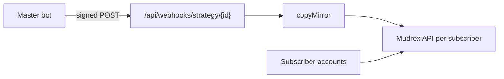

# RexAlgo — PM-facing README (draft for repo root)

> Copy to `RexAlgo/README.md` top sections or use as interview case-study. Full technical README remains below for engineers.

**RexAlgo** is a Mudrex Futures product for **strategy masters** and **subscribers**: publish algo or copy-trading strategies, mirror signed signals into each subscriber’s own Mudrex account, and run trade-idea (TIA) flows with optional auto-execution.

**Who it’s for:** Retail traders who want curated strategies without giving custody to a master; masters who need review gates, webhooks, and subscriber analytics without building exchange plumbing.

---

## The problem

Mudrex exposes a capable Futures API, but retail copy-trading needs more than REST: identity, encrypted per-user API keys, strategy review, webhook authenticity, fan-out mirroring, and honest volume reporting. Bolting that onto scripts does not scale to production.

---

## What we built (product decisions)

| Decision | Chosen | Rejected | Why |
|----------|--------|----------|-----|
| Execution venue | Mudrex Futures only | Multi-exchange | Focus, compliance, one limiter model |
| Copy signal ingress | HMAC webhooks + idempotency | Polling-only | Lower latency; polling kept for `manual` copy mode |
| Subscriber funds | Each user’s Mudrex key | Master custody | Regulatory and trust boundary |
| Rate limiting | Mirror Mudrex futures vs wallet buckets | Single global throttle | Matches published API caps |
| AI / agents | Roadmap: read-only MCP (see `repo/project.json`) | Autonomous trading agent in v1 | Scope control |

---

## How it works

Details: `docs/CONTEXT.md` · Diagrams: `repo/architecture.mmd`

---

## Trade-offs

- **Proprietary monorepo** — velocity and IP protection vs open-source community.
- **Postgres ledger complexity** — volume attribution and close-leg modeling are hard; documented in `docs/audit/FINDINGS.md`.
- **Private repo** — hiring reviewers need profile case study or granted access.

---

## Outcomes

`TODO[JM]:` subscribers, strategies approved, signals/day, production URL, retention — see `portfolio-rewrite/artifacts/outcomes-rexalgo.md`.

---

## What I’d do differently

`TODO[JM]:` one honest product regret (e.g. earlier ledger sidecar, earlier public docs index).

---

## Tech notes

Vite/React · Next.js API · Postgres (Drizzle) · optional Redis · Vercel + Railway · CI + k6 load tests. See full README for setup.
