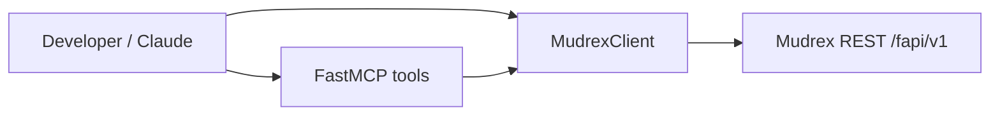

# Mudrex Futures Python SDK — PM-facing header (draft)

**Unofficial Python client and MCP server** for the [Mudrex Futures API](https://docs.trade.mudrex.com/docs/overview). For integrators, quant scripts, and AI agents (Claude Desktop, Cursor) that need bounded trading tools.

---

## The problem

Integrators hit the same walls: rate limits across route families, opaque error codes, pagination on history endpoints, and no standard way to expose trading actions to LLMs without handing over raw HTTP.

---

## What we decided to build

| Decision | Why |
|----------|-----|
| Modular client (`wallet`, `orders`, `positions`, …) | Matches API mental model; easier docs |
| Client-side `RateLimiter` + 429 retry with `Retry-After` | Failures are predictable, not mysterious |
| Typed errors with suggestions (`mudrex/exceptions.py`) | Support deflection; faster debugging |
| **MCP server** (`mudrex/mcp/`) | Same surface for humans and agents — 20 tools, TypedDict returns |
| Sync `requests` core + async **example** wrapper | Ship reliability first; async via executor in `examples/async_trading.py` |

**Rejected for v1:** Native async client (complexity); multi-exchange abstraction.

---

## How it works

---

## Trade-offs

- Unofficial SDK — we document drift vs official docs; changelog is the contract.
- MCP runs locally (stdio) — simple security model; not a hosted agent platform.

---

## Outcomes

`TODO[JM]:` PyPI/downloads if published, GitHub stars (currently low), known integrators, MCP adoption.

---

## Tech notes

Python 3.9+ · `pip install` · `MCP_SETUP.md` · tests in `tests/`. See existing README for API reference.
