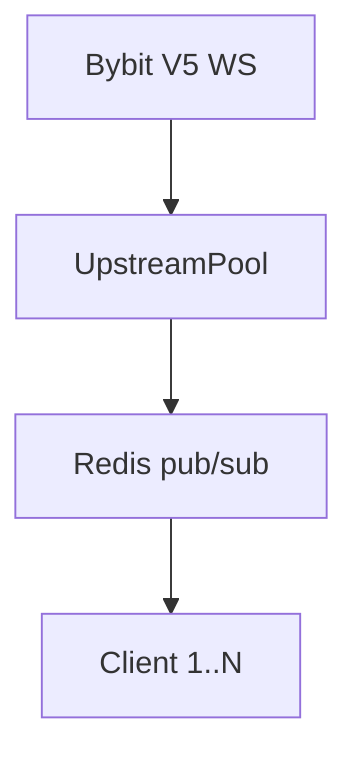

# Mudrex Futures WebSocket Proxy — PM-facing header (draft)

**Realtime market-data proxy** for Mudrex-branded futures streams: one **Bybit V5** upstream, transform payloads, fan out over **Redis pub/sub** to many clients.

---

## The problem

Every chart, bot, or mobile client opening its own exchange WebSocket wastes connections, complicates rate limits, and produces inconsistent stream naming. Integrators need **one Mudrex-shaped contract**.

---

## What we decided to build

| Decision | Why |
|----------|-----|
| Single upstream per category (linear/inverse/spot) | Cost + connection caps |
| Redis subscription ref-counting | Subscribe to Bybit only while ≥1 client cares |
| `standalone_server.py` (no FastAPI on hot path) | Latency and ops simplicity |
| Per-client receive rate limits + idle cleanup | Abuse protection at scale |
| Health `/health`, `/ready`, `/stats` on same port | Railway/K8s friendly |

**Rejected:** Per-client upstream sockets; pushing transform logic to clients.

---

## How it works

---

## Trade-offs

- Bybit as data vendor — Mudrex branding on wire format, not exchange diversity.
- Redis dependency — ops cost vs horizontal fan-out.

---

## Outcomes

`TODO[JM]:` peak concurrent clients, messages/sec, uptime — if measured.

---

## Tech notes

Python · asyncio · `app/upstream/bybit_client.py` (reconnect + backoff) · `tests/test_transformer.py`. See README for subscribe API.
